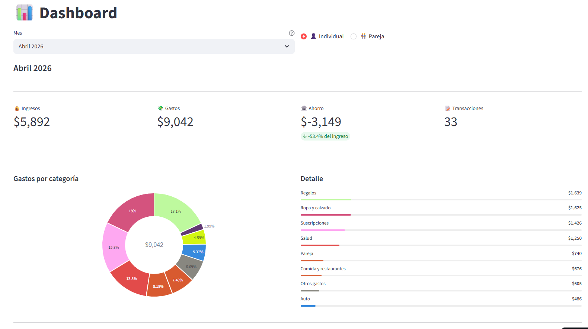
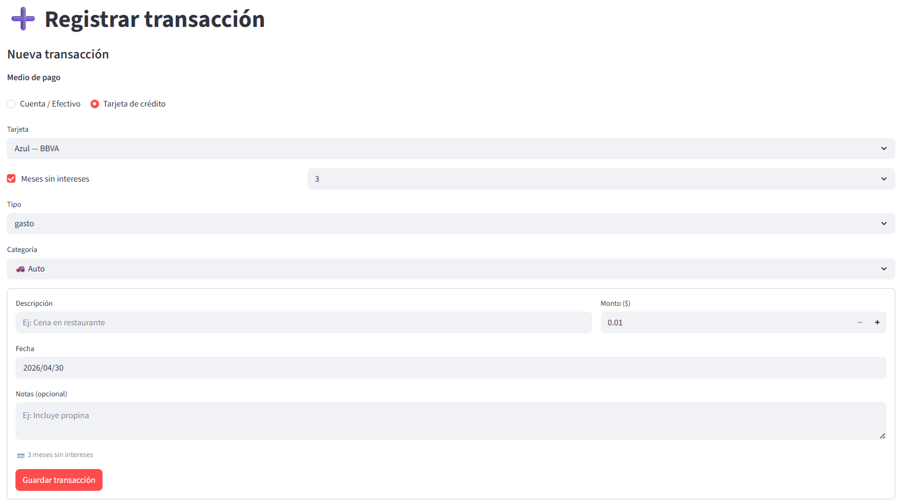
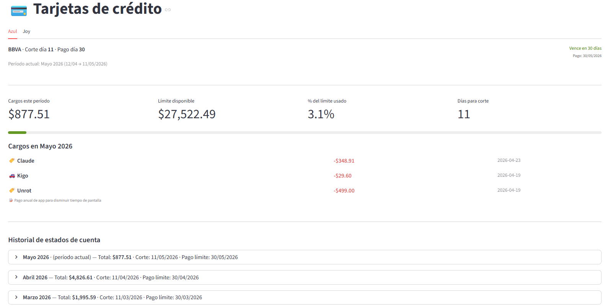

# Finanzas

Aplicación web para gestión de finanzas personales en pareja. Permite llevar el control de ingresos, gastos, tarjetas de crédito, préstamos y liquidaciones entre dos usuarios.

## Tecnologías

- **Frontend/Backend**: [Streamlit](https://streamlit.io/)
- **Base de datos**: PostgreSQL en [Supabase](https://supabase.com/)
- **Visualización**: Plotly
- **Procesamiento de datos**: Pandas

## Funcionalidades

- **Dashboard**: Resumen mensual de ingresos, gastos y ahorro; desglose de gastos por categoría; estado de tarjetas de crédito; balance de pareja.

- **Transacciones**: Registro de ingresos y gastos con soporte para pagos con tarjeta de crédito y meses sin intereses (MSI).

- **Tarjetas de crédito**: Seguimiento por fecha de corte, cálculo de saldo del estado de cuenta actual y proyecciones de MSI.

- **Préstamos**: Control de dinero prestado/recibido entre usuarios, pagos parciales y liquidación.
- **Liquidaciones**: Cálculo del balance mensual entre los dos usuarios y registro de transferencias de saldo.
- **Configuración**: Gestión de usuarios, cuentas bancarias, tarjetas de crédito y categorías personalizadas.

## Estructura del proyecto

```
Finanzas/
├── app.py                 # Punto de entrada y navegación
├── requirements.txt
├── database/
│   ├── schema.py          # Creación de tablas y migraciones
│   └── queries.py         # Todas las operaciones de base de datos
├── views/                 # Módulos de interfaz (uno por página)
│   ├── dashboard.py
│   ├── transacciones.py
│   ├── tarjetas.py
│   ├── prestamos.py
│   ├── liquidaciones.py
│   └── configuracion.py
└── utils/
    └── calculos.py        # Lógica financiera (sin dependencias de Streamlit)
```

## Instalación local

### Requisitos

- Python 3.10+
- Una instancia de PostgreSQL o proyecto en Supabase

### Pasos

1. Clonar el repositorio:

```bash
git clone https://github.com/StephanieFortiz/Control_de_finanzas.git
cd Finanzas
```

2. Crear y activar un entorno virtual:

```bash
python -m venv .venv
source .venv/bin/activate        # Linux/macOS
.venv\Scripts\activate           # Windows
```

3. Instalar dependencias:

```bash
pip install -r requirements.txt
```

4. Configurar las credenciales de la base de datos en `.streamlit/secrets.toml`:

```toml
[supabase]
url      = "https://<proyecto>.supabase.co"
key      = "<anon-key>"

[postgres]
host     = "db.<proyecto>.supabase.co"
port     = 5432
dbname   = "postgres"
user     = "postgres"
password = "<password>"
```

5. Iniciar la aplicación:

```bash
streamlit run app.py
```

La app crea las tablas automáticamente en el primer arranque.

## Variables de entorno / Secretos

El archivo `.streamlit/secrets.toml` **no se sube al repositorio**. Consulta el archivo `.gitignore` para ver qué archivos se excluyen.

## Licencia

Uso personal — sin licencia pública.